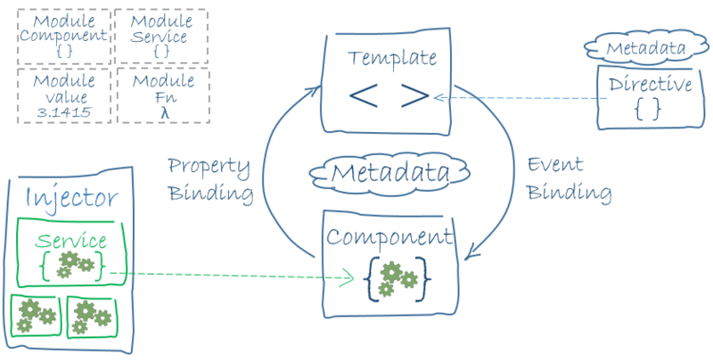
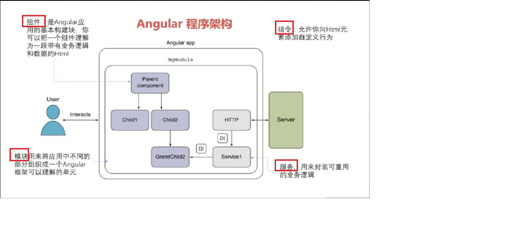
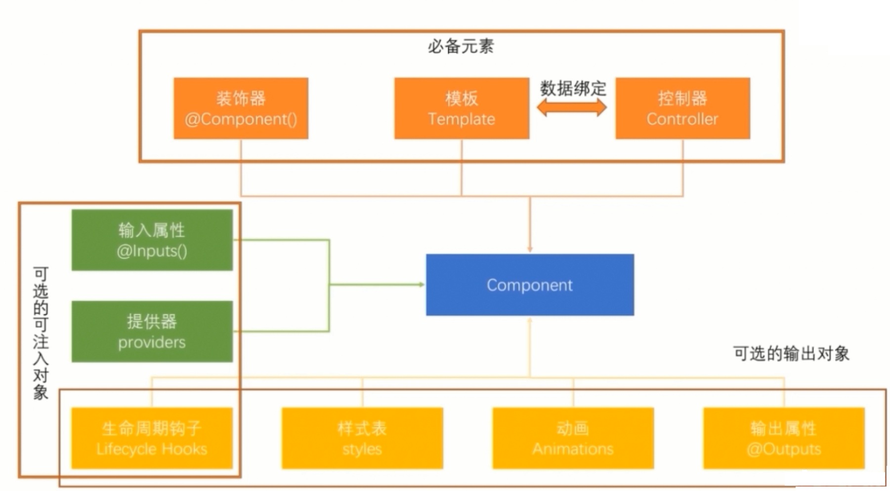

# Angular

## 主讲：崔译

### 一、Angular简介

用于解决、实现一个  SPA (Single Page Application 单页应用程序)

简化对DOM的操作，动态的更新DOM对象 

使用的是 模块化 开发思想

> ​	Angular is a framework for building client applications in HTML and either JavaScript or a language like TypeScript that compiles to JavaScript.

Angular 是一个 使用HTML 和 JavaScript 或者像是TypeScript一样能够编译成JavaScript的语言 来  创建客户端应用程序 框架

### 二、版本

Angular 只有4这个版本

1.x  2.x 叫做 AngularJS

分水岭：1 和 2

为什么没有3

```
https://github.com/angular/angular/blob/2.3.x/modules/%40angular/router/CHANGELOG.md
```

可以看到，在@augular/router 模块的版本 和Angular的版本 未对齐，导致使用上的混乱，因此Angular团队决定 跳过3这个版本  直接使用4

### 三、Angular程序架构



- 模块 Module

- 组件 Component

- 模板 Template

- 元数据 Metadata

- 数据绑定 data binding

- 指令 directive

- 服务 service

- 依赖注入 Dependency Injection

  ````
  用户  ===> root Module (是Angular应用程序的起始,入口,首页)
  Angular Application ==> 模块 + 模块 + 模块 + .... + 模块
  模块 ====》 组件 + 子模块 + 服务
  组件  ===》 组件三要素 + 可选要素
  组件三要素 ===> 模板 + 装饰器 + 控制器
  可选要素 ===> 输入属性 + 输出属性 + 提供器 + 生命周期函数 + 样式表 + 动画
  模板 ===> html + css + Angularized markup (Angular自己的标签)
  ````

  

### 四、开发环境的搭建

#### 1、安装NodeJS

#### 2、安装 Angular/CLI 

CLI : Command Line Interface 命令行接口（一些终端命令，用于快速搭建Angular项目以及开发===> 脚手架）

```powershell
【sudo】 cnpm install -g @angular/cli
ng -v
```


### 五、HelloWorld

#### 1、创建项目

```powershell
#切换到要创建项目的目录下
#ng new 项目名 [参数]
ng new itanyangular --routing
#Angular会创建一个项目，同时npm install 
#120M左右 ==> 下载很慢  ctrl + c
#切换到项目目录下(package.json所在目录)
cnpm install 
#npm config set registry https://registy.npm.taobao.org 
#ng set --global packageManager=cnpm 
```

#### 2、目录结构

**建议不要修改cli生成的文件或者文件夹的名字，除非你知道你在做什么**

```
项目
|---e2e 端到端的测试目录
|---node_modules 第三方的依赖包
|---src 应用程序源代码目录
	|---app 应用中的所有的组件或者模块 (i)
	|---assets 静态资源  图片等等
	|---environments Angular是支持多环境开发的(开发环境  测试环境  生产环境的配置)
	favicon.ico 图标文件
	index.html 首页(i)
	main.ts 整个app的入口，Angular会从该问价加载整个app(i)
	polyfills.ts 做老版本浏览器支持
	styles.css 全局样式文件(i)
	test.ts 测试文件
	tsconfig.app.json 编译器的配置文件
	tsconfig.spec.json
	typings.d.ts
.angular-cli.json cli工具的配置(i)
.editorconfig 编辑器配置文件
.gitignore git配置文件
karma.conf.js 单元测试
package.json npm工具的配置文件
protractor.conf.js 自动化测试的配置文件
README.md
tsconfig.json 定义typescript配置的配置文件
tslint.json 进行ts文件代码质量检测的配置文件
```

#### 3、运行HelloWorld

```powershell
ng serve
#需在项目目录下执行
#npm run start 
#start 是定义在package.json中的一个命令
```

#### 4、启动过程

```
.angular-cli.json 定义了应用程序首页和入口ts文件
--->index.html --> 加载页面
--->main.ts ---> bootstrapModule --> 引导模块 ---> 某个组件  --> 组件模板  css 选择器
---> 使用选择器，定位index.html中的第一个匹配标签，将模板的内容append到标签中
```


### 六、再探HelloWorld

#### 1、.angular-cli.json

```json
{
  "$schema": "./node_modules/@angular/cli/lib/config/schema.json",
  // 项目相关信息
  "project": {
    // 项目名
    "name": "itanyangular"
  },
  //整个应用程序配置
  "apps": [
    {
      //根目录
      "root": "src",
      //项目发布时的输出目录
      "outDir": "dist",
      // 静态资源（文件/文件夹）
      "assets": [
        "assets",
        "favicon.ico"
      ],
      // 项目的首页
      "index": "index.html",
      // 指定项目入口（主加载文件）
      "main": "main.ts",
      "polyfills": "polyfills.ts",
      "test": "test.ts",
      "tsconfig": "tsconfig.app.json",
      "testTsconfig": "tsconfig.spec.json",
      "prefix": "app",
      // 定义全局样式，包括第三方样式库 bootstrap
      "styles": [
        "styles.css"
      ],
      // 全局js文件主要指第三方js  注意  需要描述文件
      "scripts": [],
      "environmentSource": "environments/environment.ts",
      "environments": {
        "dev": "environments/environment.ts",
        "prod": "environments/environment.prod.ts"
      }
    }
  ],
  "e2e": {
    "protractor": {
      "config": "./protractor.conf.js"
    }
  },
  "lint": [
    {
      "project": "src/tsconfig.app.json"
    },
    {
      "project": "src/tsconfig.spec.json"
    },
    {
      "project": "e2e/tsconfig.e2e.json"
    }
  ],
  "test": {
    "karma": {
      "config": "./karma.conf.js"
    }
  },
  "defaults": {
    "styleExt": "css",
    "component": {}
  }
}
```

#### 2、main.ts

```typescript
import { enableProdMode } from '@angular/core';
import { platformBrowserDynamic } from '@angular/platform-browser-dynamic';

import { AppModule } from './app/app.module';
import { environment } from './environments/environment';

if (environment.production) {
  enableProdMode();
}
// bootstrapModule 定义引导(启动)模块=》AppModule
platformBrowserDynamic().bootstrapModule(AppModule)
  .catch(err => console.log(err));
  // .catch(function(err){
  //   console.log(err)
  // })

```

#### 3、app.module.ts

```typescript
import { BrowserModule } from '@angular/platform-browser';
import { NgModule } from '@angular/core';

import { AppRoutingModule } from './app-routing.module';
import { AppComponent } from './app.component';

// 装饰器 表示AppModule这个类是一个Angular的模块
@NgModule({
  //定义的是该模块中所有的组件以及管道
  declarations: [
    AppComponent
  ],
  // 导入的其他模块
  imports: [
    //默认情况下，只有BrowserModule 浏览器模块，该模块提供关于浏览器的支持
    BrowserModule,
    //路由模块，该模块是 --routing 产生的
    AppRoutingModule
  ],
  // 提供者 和DI 依赖注入相关的内容
  // 其实Angular是一个小型的IOC容器
  providers: [],
  // 启动引导组件
  bootstrap: [AppComponent]
})
export class AppModule { }
```

#### 4、app.component.ts

```typescript
import { Component } from '@angular/core';

// 一般情况下一个组件包括一个ts 文件  一个html文件  一个css文件
// 这三个文件文件名相同，放在同一个文件夹下
// 用于表示下面的类是一个 组件
@Component({
  // 选择器 --> id 类  标签(建议)  父子 
  selector: 'app-root',
  // selector: '.cc',
  // 组件模板所在的文件
  templateUrl: './app.component.html',
  // 模板对应的css文件
  styleUrls: ['./app.component.css']
})
export class AppComponent {
  title = 'Itany';
  hello = '你好';
}

```

### 七、添加第三方类库

#### 1、下载类库

```powershell
#--save 将类库的依赖添加到package.json的dependency节点中 
#-dev 添加到package.json的devDependency节点中
cnpm install jquery --save
cnpm install bootstrap --save
```

#### 2、将类库引入到项目中

在 .angular-cli  文件中添加

```typescript
"styles": [
  "styles.css",
  "../node_modules/bootstrap/dist/css/bootstrap.css"
],

"scripts": [
    "../node_modules/jquery/dist/jquery.js",
    "./node_modules/bootstrap/dist/js/bootstrap.js"
],
```

#### 3、安装类型描述文件

为了能够在ts中使用jquery对象等

```powershell
#--save 将类库的依赖添加到package.json的dependency节点中 
#-dev 添加到package.json的devDependency节点中
cnpm install @types/jquery --save-dev
cnpm install @types/bootstrap --save-dev
```

### 八、组件-Component

#### 1、组件结构




#### 2、文件结构

```
src
|---app
    |--- 组件名
        |---组件名.component.css
        |---组件名.component.ts
        |---组件名.component.html
        |---组件名.component.spec.ts
```

#### 3、创建组件

##### 3-1 手动创建

根据文件结构创建组件中的各文件，修改app.mudule.ts文件，导入新建的组件

```typescript
// 装饰器 表示AppModule这个类是一个Angular的模块
@NgModule({
  //定义的是该模块中所有的组件
  declarations: [
    AppComponent,
    First
  ],
  //.......
}
```

##### 3-2 通过cli命令创建

```powershell
ng generate component  组件名
ng g component  组件名
```

### 九、模板

```typescript
import { Component, OnInit } from '@angular/core';

@Component({
  selector: 'app-template',
  // 指定模板内容所在的文件
  templateUrl: './template.component.html',
  // 使用template指定模板内容
  // template:`<h1>hello template!!!<h1>`,
  styleUrls: ['./template.component.css'],
})
export class TemplateComponent implements OnInit {

  constructor() { }

  ngOnInit() {
  }

}

```

### 十、数据绑定

将组件对应的类中的属性和方法 绑定到 模板html上，当组件中的属性值更改的时候，页面会随之更改，而无须操作DOM

#### 1、前置知识

```html
<!DOCTYPE html>
<html lang="en">
<head>
    <meta charset="UTF-8">
    <meta name="viewport" content="width=device-width, initial-scale=1.0">
    <meta http-equiv="X-UA-Compatible" content="ie=edge">
    <title>Document</title>

</head>
<body>
    
    <div id="d" style="color:rgba(21, 24, 218, 0.41)" someAttr="itany">aaaa</div>

    <table>
        <tr>
            <td id="td" colspan="2"></td>
        </tr>
    </table>

    <script>
        
        var div = document.getElementById("d");
        // 取的是dom对象的 dom 属性
        var value = div.someAttr;
        console.log(value);//=>undefined
        // html属性 ==》 html标签上的属性
        var value2 = div.getAttribute("someAttr");
        console.log(value2);//=> itany

        var style = div.style;
        console.log(style.color);

        var td = document.getElementById("td");
        console.log(".colspan =>" ,td.colspan);//==> undefined 
        console.log("getAttr=>",td.getAttribute("colspan"));//==> 2

    </script>

</body>
</html>
```

**模板数据绑定是通过dom属性和事件进行工作的**

#### 2、插值表达式

```
{{xxx}}
```

```typescript
<h1>插值表达式</h1>

<p>普通文本</p>
<p> {{ '这是普通的字符串文本' }} </p>
<p>进行计算</p>
<span>支持常用表达式,不支持位运算</span>
<p>{{ 2+3*2 }}</p>
<p>{{1 > 3}}</p>
<p>数据绑定</p>
<p>name : {{name}}</p>
```

```typescript
import { Component, OnInit } from '@angular/core';

@Component({
  selector: 'app-databind',
  templateUrl: './databind.component.html',
  styleUrls: ['./databind.component.css']
})
export class DatabindComponent  {
  name:string = "老王";

  constructor()
  {
      setTimeout(()=>this.name="哈哈",3000);
//
  }
}

```


#### 3、事件绑定

```html
<button (事件名/类似于jquery bind方法的事件名)="类中的方法名()" >xxxx</button>
<button (事件名/类似于jquery bind方法的事件名)="语句" >xxxx</button>
```


```typescript
<p>事件绑定</p>
<button (click)="handleClick($event)">按钮1</button>
<button (click)="handleClick($event)">按钮2</button>
<p>也可以在插值表达式中调用方法</p>
{{ handleClick() }}

<div *ngIf="flag">aaaa</div>

<button (click)="toggle()">切换</button>
<button (click)="this.flag = !this.flag">切换2</button>
```

```typescript
import { Component, OnInit } from '@angular/core';

@Component({
  selector: 'app-databind',
  templateUrl: './databind.component.html',
  styleUrls: ['./databind.component.css']
})
export class DatabindComponent  {

  handleClick(e)
  {
    // e 就是JavaScript中的事件对象
    // target 属性  就是  事件源 ==》 DOM对象
    console.log('按钮被点击',e?e.target.innerHTML:"");
    return "itany";
  }

  flag:boolean = true;

  toggle(){
    // if(this.flag)
    // {
    //   this.flag = false;
    // }else{
    //   this.flag = true;
    // }
    this.flag = !this.flag;
  }

}

```

#### 4、DOM属性的绑定

```typescript
username:string="chw0564";
  imgUrl:string;
  nullUrl:string;


  setUsername()
  {
    this.username = "random:" + Math.random();
  }

  getUsername()
  {
    var input = document.getElementById("input");
    console.log("html=>", input.getAttribute("value"));
    console.log(this.username);
  }

  doOnInput(e)
  {
    console.log(e.target.value);
  }
```


```html
<hr>
<h3>获取组件（ts类）中的属性</h3>
<h4>{{username}}</h4>
<!-- 
    =右边有{}，左边就没东西
    =左边有[] ，右边就没东西
-->
<h4 id="{{username}}">方式1</h4>
<h4 [id]="username">方式2</h4>
<span>建议使用方式2</span>
<a href="{{nullUrl}}">方式1-插值表达式</a>
<a [href]="nullUrl">方式2-[属性]</a>
<h3>
    <span>注意：凡是能导致网络请求发送的时候，如果地址是异步加载，使用方式1</span>
</h3>
<a href="{{imgUrl}}">点击1</a>
<a [href]="imgUrl">点击2</a>


<!--
    以下写法存在问题：
        会多发送一次请求    
-->

<hr>
<input id="input" type="text" [value]="username" />
<button (click)="setUsername()">set username</button>
<button (click)="getUsername()">get username</button>
<span>
    <ul>
        <li>单向数据绑定</li>
        <li>组价中的属性值发生更改，会影响DOM</li>
        <li>DOM中值发生更改 不影响组件中的属性</li>
        <li>改的是DOM属性，不是HTML属性</li>
    </ul>
</span>

<input type="text" (input)="doOnInput($event)">
```

**特殊属性：disabled**

```html
<h1>disabled属性</h1>
<button>普通按钮</button>
<button disabled>按钮1</button>
<button disabled="false">按钮2</button>
<button disabled="true">按钮3</button>
<button disabled=false >按钮4</button>
<br>
<button disabled="{{flag}}" >按钮5</button>
<!-- 只有下面这种添加方式才能实现禁用和启用的切换 -->
<button [disabled]="flag" >按钮6</button>
<button (click)="this.flag = !this.flag">toggle</button>
```

#### 5、HTML属性的绑定

当且仅当没有对应的DOM属性的时候，才考虑使用HTML属性绑定

##### 5-1、基本HTML属性

```html
<h1>HTML属性绑定</h1>
<table border="1" cellspacing="0" cellpadding="5">
    <tr>
        <td [attr.colspan]="colspan">xxxxxx1</td>
        <td>xxxxxx2</td>
    </tr>
    <tr>
        <td>xxxxxx3</td>
        <td>xxxxxx3</td>
        <td>xxxxxx3</td>
    </tr>
    <tr>
        <td>xxxxxx4</td>
        <td>xxxxxx4</td>
        <td>xxxxxx4</td>
    </tr>
</table>
<button (click)="changeCol(1)" >+</button>
<button (click)="changeCol(-1)" >-</button>
```

```typescript
colspan:number=3;
changeCol(n:number)
{
  this.colspan += n;
}
```

##### 5-2、css类的绑定

```html
<h1>css类class的绑定</h1>
<div class="red green fs40">this is a div</div>
<div [class]="divCls">div2.....</div>
<!-- [class.样式名]=“布尔值（布尔类型表达式1>2） 当表达式为true的时候，使用该样式，否则不使用” -->
<div class="red green" [class.fs40]="isLarger">div3....</div>
<button (click)="this.isLarger = !this.isLarger">toggleLarger</button>
<!-- [ngClass]是固定写法，ngCls是一个json对象，
    key是样式名字，value是true或者false
    如果为true，则使用对应的样式
-->
<div [ngClass]="ngCls">div4.....</div>
<button (click)="ngCls.red = !ngCls.red">red</button>
<button (click)="ngCls.green = !ngCls.green">green</button>
<button (click)="ngCls.fs40 = !ngCls.fs40">fs40</button>
```

```typescript
 divCls:string = "red green fs40";

  ngCls:any = {
    "red":true,
    "green":false,
    "fs40":true
  }
```

```css
.red{
    background-color: red;
}
.green{
    color:green;
}
.fs40{
    font-size: 20px;
    margin-top: 10px;
}
```


##### 5-3、style绑定

```html
<h1>style属性的绑定</h1>
<div style="color:red" >div1......</div>
<!-- 
    语法：
        [style.样式名.单位] 单位可以省略
 -->
<div [style.color]="ngCls.red ? 'red' : 'blue'" >div2......</div>
<div [style.font-size]="ngCls.fs40?'40px':'20px'">div3....</div>
<div [style.font-size.px]="ngCls.fs40?'40':'20'">div4....</div>
<!-- 
    [ngStyle]="组件中的属性" 属性是json key是style的属性名 value是style的属性值
 -->
<div [ngStyle]="ngStyle">div4....</div>
```

```typescript
 ngStyle:any = {
    "background-color":"#ccc",
    "color":"#fff"
  }
```

#### 6、数据的双向绑定

所谓的数据双向绑定指的是**不论视图（View，html模板）或者  模型(model 数据模型 组件中的属性) 中的哪一方发生了更改，另一方都会随着改变**

**Angular4 不再默认提供双向数据绑定功能，将双向数据绑定放到了@angular/forms模块中，在使用双向数据绑定之前，首先要在app.module.ts中导入FormsModule模块,同时在import配置项中添加该模块**

**app.modul.ts**

```typescript
import {FormsModule} from '@angular/forms';
@NgModule({
    
  declarations: [
  ],
  imports: [
    FormsModule
  ],
  providers: [],
  bootstrap: [AppComponent]
})
export class AppModule { }

```

```html
<!-- banana in a box [()] -->
<input type="text"  [(ngModel)]="newMsg">
<h5>用户输入的内容是:{{newMsg}}</h5>
```


### 十一、指令

directive，指令是Angular对html标签以及标签属性进行的扩展

几乎所有的常用指令都是以下格式

```html
<xxx *ngYyyy="" ></xxx>
```

下面将的指令，除非特别说明，否则指令前都带有 *

#### 1、ngIf

语法

```html
<!--expression 是boolean类型值或者boolean类型表达式-->
<xx *ngIf="expression"></xx>
```

作用

如果表达式为真，则显示指令所在标签，否则不显示


#### 2、ngSwitch系列

```html
<h2>ngswitch-ngswitchcase-ngswitchdefault</h2>

<input type="text" [(ngModel)]="name" /> {{name}}
<ul [ngSwitch]="name">
  <li *ngSwitchCase="'zhangsan'" >张三</li>
  <li *ngSwitchCase="'lisi'" >李四</li>
  <li *ngSwitchCase="xiedong" >老司机</li>
  <li *ngSwitchDefault>未知</li>
</ul>
```


#### 3、ngFor

作用：对指令所在标签进行循环

```typescript
addrs:Array<string> = "南京,徐州,上海,苏州,无锡,常州,北京,<a href='#'>aa</a>".split(",");

  users:Array<any> = [
    {"username":"zhangsan1","password":"1231"},
    {"username":"zhangsan2","password":"1232"},
    {"username":"zhangsan3","password":"1233"},
    {"username":"zhangsan4","password":"1234"},    
    {"username":"zhangsan5","password":"1235"},
  ];

  city:string;
  addCity(){
    this.addrs.push(this.city);
  }
```

```html
<h2>ngFor</h2>
<ul>
  <!-- 
    let  变量名  of  要循环的内容 [ | index as 变量名;first as 变量名;last as 变量名;even as 变量名;odd as 变量名 ]
    index表示下标，其余的boolean类型
    变量名对应每次循环的元素，可以直接使用插值表达式获取值
  -->
  <li *ngFor="let item of addrs" >{{item}}</li>
</ul>

<hr>
<!-- 
  第0条和最后一条 字体变大
  偶数条  红色
  奇数条  蓝色

 -->
<ul>
  <li *ngFor=" let item of addrs ; index as i ; first as isFirst ; last as isLast ; even as isEven ; odd as isOdd"
    [class.bigger]="isFirst || isLast"
    [class.red]="isEven"
    [class.blue]="isOdd"
  >
    第{{i}}个城市是：{{item}}--{{isFirst}}---{{isLast}}--{{isEven}}---{{isOdd}}
  </li>
</ul>


<ul>
    <li template="ngFor let item of addrs ; index as i ; first as isFirst ; last as isLast ; even as isEven ; odd as isOdd"
      [class.bigger]="isFirst || isLast"
      [class.red]="isEven"
      [class.blue]="isOdd"
    >
      第{{i}}个城市是：{{item}}--{{isFirst}}---{{isLast}}--{{isEven}}---{{isOdd}}
    </li>
</ul>
<hr>

<ul>
  <li *ngFor="let u of users">
    用户名：{{u.username}} 密码：{{u.password}}
  </li>
</ul>
<br>
<span>ngFor也属于数据绑定</span>
<br>
<input type="text" placeholder="城市" [(ngModel)]="city" />
<button (click)="addCity()">add</button>
```

### 十二、管道

#### 1、内置管道

pipe,在Angular1.x 叫做  过滤器Filter  对数据进行 格式化 或者  过滤 操作

语法：

```html
{{ data | 管道名字 [:管道参数:管道参数.....] }}
```


```html
<input type="text" [(ngModel)]="num">


<p>值是：{{num}}</p>
<!-- 使用货币管道，使用USD（美元），false：不使用美元符号  默认 保留两位小数-->
<p>值是：{{num | currency : 'USD' :false }}</p>
<p>值是：{{num | currency : 'USD' :true }}</p>
<!-- 位数格式
    ‘a.b-c’
    a:整数部分的最小位数，不足补0
    b:小数部分的最小位数，不足补0
    c：小数部分的最大位数，超出部分四舍五入
-->
<p>值是：{{num | currency : 'USD' :true : '4.2-3'}}</p>

<!-- 完成下面代码，使得两行显示内容永远相同 -->
<p>{{ num | currency  }}</p>
<p>{{ num | currency : 'USD' : false : '1.2-2' }}</p>

<h1>jsonPipe</h1>
<p>{{zbw}} ---- [object Object] </p>
<p>{{zbw | json }}</p>


<h1>datePipe</h1>
<!-- 
    {{ d | date [:FORMAT] }}
    format:
      'medium': equivalent to 'yMMMdjms' (e.g. Sep 3, 2010, 12:05:08 PM for en-US)
      'short': equivalent to 'yMdjm' (e.g. 9/3/2010, 12:05 PM for en-US)
      'fullDate': equivalent to 'yMMMMEEEEd' (e.g. Friday, September 3, 2010 for en-US)
      'longDate': equivalent to 'yMMMMd' (e.g. September 3, 2010 for en-US)
      'mediumDate': equivalent to 'yMMMd' (e.g. Sep 3, 2010 for en-US)
      'shortDate': equivalent to 'yMd' (e.g. 9/3/2010 for en-US)
      'mediumTime': equivalent to 'jms' (e.g. 12:05:08 PM for en-US)
      'shortTime': equivalent to 'jm' (e.g. 12:05 PM for en-US)
 -->
{{d | date : 'yyyy-MM-dd HH:mm:ss EEEE'}}
```

```typescript
import { Component, OnInit } from '@angular/core';

@Component({
  selector: 'app-common-pipe',
  templateUrl: './common-pipe.component.html',
  styleUrls: ['./common-pipe.component.css']
})
export class CommonPipeComponent {

  num:number = 12.3;

  zbw:any = {
    name : 'cc',
    age : 90,
    sex:'unknown'
  }

  d:Date = new Date();

  constructor()
  {
    // alert(JSON.stringify(this.zbw));
  }
}

```

#### 2、自定义管道

##### 2-1、手动定义

1. 创建管道的ts文件
2. 在app.model.ts中引入创建的管道
3. 和内置管道一样使用自定义管道

##### 2-2、使用命令

```
ng g pipe 路径/名字
```


### 十三、组件间的通信


#### 1、父组件向子组件传值-输入属性

```html
<!--父组件-->
<p>parent works!</p>

<input type="text" [(ngModel)]="name">
<input type="text" [(ngModel)]="age">
<span>  父组件名字是:{{name}},年龄是{{age}}</span>
<hr><hr>
<app-child-a [childAname]="name" [childAage]="age" ></app-child-a>

```

```typescript
//子组件ts文件
import { Component, OnInit, Input } from '@angular/core';

@Component({
  selector: 'app-child-a',
  templateUrl: './child-a.component.html',
  styleUrls: ['./child-a.component.css']
})
export class ChildAComponent{

  //该属性是一个输入属性
  @Input()
  childAname:string;

  //该属性是一个输入属性
  @Input()
  childAage:string;
}
```

```html
<p>child-a works!</p>
名字是:{{childAname}},年龄是{{childAage}}
```

#### 2、子组件向父组件传值-输出属性

子组件

```typescript
  // 该属性是一个输出属性
  // 对于输出属性的类型，是一个EventEmitter<原始类型>的类型
  @Output()
  backName:EventEmitter<string> = new EventEmitter<string>();

  sendBack(){
    //this.backName = this.childAname.toUpperCase();
    // 调用该属性的emit方法，参数是想要传递的数据/参数是事件源
    // EventEmiiter 用于触发一个事件的类  emit方法是触发事件
    // 触发一个backName事件
    this.backName.emit(this.childAname.toUpperCase());
  }
```

父组件模板

```html
<p>parent works!</p>

<input type="text" [(ngModel)]="name">
<input type="text" [(ngModel)]="age">
<span>  父组件名字是:{{name}},年龄是{{age}}</span>
<h3>子组件回传的值：{{childABackName}}</h3>
<hr><hr>

<!-- 在用户自定义事件中 -->
<app-child-a [childAname]="name" [childAage]="age" (backName)="handleBackName($event)"></app-child-a>


<hr><hr>


<app-child-b></app-child-b>
```

父组件

```typescript
  childABackName:string;
  handleBackName(e)
  {
    this.childABackName = e;
  }
```


### 十四、表单处理

Angular对于表单标签做了特殊处理，提供了两种处理表单的方式，分别叫做 模板式表单  和  响应式表单，对应两个不同的模块

```typescript
//app.module.ts
 imports: [
    BrowserModule,
    AppRoutingModule,
    // 模板式表单
    FormsModule,
    //响应式表单
    ReactiveFormsModule
  ],
```

#### 1、模板式表单

适用于一些简单场景（用于处理简单的表单）

使用指令来定义表单控件

| 名称           | 作用                                       |
| ------------ | ---------------------------------------- |
| ngForm       | 表单指令，会自动的被添加到form标签上，隐式的创建FormGroup类的实例（对象），该对象对应着表单的数据模型并且存储着表单中的数据。具有该指令的标签，会自动的观测（观察）所有的具有ngModel指令的子标签，并将值添加到表单的数据模型中 |
| ngModel      | 隐式的创建了一个FormControl类的实例，用于绑定用户输入的值，在表单标签上提供该指令的时候，同时要指定name属性，作为ngForm中的value对象的key的值。与ngForm类似，ngModel也可以指定模板变量 |
| ngModelGroup | 代表表单的一部分，将一些表单字段组织在一起，形成清晰的层级关系，生成一个FormArray实例 |

```html
<form action="a.html" method="post" #myForm="ngForm" (ngSubmit)="doSiubmitForm(myForm.value,$event)">

  <input type="text" ngModel name="username" placeholder="username">
  <span>错误信息</span>
  <br>
  <input type="text" placeholder="name" #name="ngModel" name="name" ngModel>
  <span>错误信息</span>

  <div ngModelGroup="pwdGroup">

    <input type="text" ngModel name="pwd" placeholder="pwd">
    <span>错误信息</span>
    <br>
    <input type="text" ngModel  name="repwd" placeholder="repwd">
    <span>错误信息</span>

  </div>  

  <hr>

  <!-- {{myForm | json }} -->

  <hr>

  {{myForm.value | json}}

  <hr>

  {{name.value}}

  <hr>
  <button (click)="showMyForm()">查看</button>
  <input type="submit" />
</form>

```

```typescript
import { Component, OnInit } from '@angular/core';
import { FormGroup } from '@angular/forms';

@Component({
  selector: 'app-template-form',
  templateUrl: './template-form.component.html',
  styleUrls: ['./template-form.component.css']
})
export class TemplateFormComponent  {

  doSiubmitForm(form,e)
  {
    console.log("success/fail",form);
    // e.target.submit();
    //ajax submit
    // 模拟表单提交
    // 将相应的错误信息放到相应的input后面
    // 用户名不能为空，name必须4-8位，密码6位以上，并且只能为数字，重复密码和密码一致 ==》 success
    //  否则：fail

  }
 
}

```

#### 2、响应式表单

通过TypeScript代码来创建底层的数据模型（Typescript类中的属性），使用指令将表单标签和数据模型关联在一起

**创建注册表单，主要包括用户名，电子邮件，年龄，密码，重复密码**

##### 2-1、创建数据模型

数据模型是指用来保存表单数据的对象，简称模型，由定义在Forms模块中的三个类组成

| 类的名称        | 作用                                       |
| ----------- | ---------------------------------------- |
| FormControl | 构成表单的基本单位，代表一个表单标签，input select等,保存了HTML元素，当前值，校验状态，是否被修改过等信息 |
| FormGroup   | 表单的一部分或者整个表单，将多个FormControl聚合在一起         |
| FormArray   | 可以增长的FormControl集合                       |

方式1

```typescript
//有一个表单
  // 表单中应该包含一个或者多个表单标签
  // myForm中应该包含一个或者多个FormControl
  myForm:FormGroup = new FormGroup({
    //对象中定义FormControl或者FormGroup或者FormArray
    username:new FormControl("someName"),
    age:new FormControl(),
    pwdGroup:new FormGroup({
      pwd:new FormControl(),
      rePwd:new FormControl()
    }),
    emails:new FormArray([
      new FormControl("a@a.com"),
      new FormControl("b@b.com")
    ])
  });
```

方式2

```typescript
myForm:FormGroup;
  constructor(builder:FormBuilder)
  {
    this.myForm = builder.group({
      username:['someVal'],
      age : [],
      pwdGroup:builder.group({
        pwd:[],
        repwd:[]
      }),
      emails:builder.array([
        ['a@a.com2'],
        ['b@b.com2']
      ])
    });
  }
```


##### 2-2、连接模型和DOM

通过指令将模型和dom标签连接在一起

| 类型          | 指令                              |
| ----------- | ------------------------------- |
| FormControl | formControl  /  formControlName |
| FormGroup   | formGroup /  formGroupName      |
| FormArray   | formArrayName                   |

```html
<form action="" method="post" [formGroup]="myForm">

  <div>
      <input type="text" placeholder="用户名" formControlName="username">
  </div>
  <div>
      <select formControlName="age">
        <option value="1">1</option>
        <option value="2">2</option>
        <option value="3">3</option>
      </select>
  </div>
  <div formGroupName="pwdGroup">
    <input type="text" placeholder="密码" formControlName="pwd">
    <input type="text" placeholder="重复密码" formControlName="repwd">
  </div>

  <div>
    <ul >
      <li *ngFor="let e of myForm.get('emails').controls;index as i">
        <input type="email" formControlName="i">
      </li>
    </ul>
  </div>

</form>
```

##### 2-3、表单数据校验

```typescript
import { Component, OnInit } from '@angular/core';
import { FormGroup, FormControl, FormArray, FormBuilder, Validators } from "@angular/forms";
@Component({
  selector: 'app-reative-form',
  templateUrl: './reative-form.component.html',
  styleUrls: ['./reative-form.component.css']
})
export class ReativeFormComponent {

  //有一个表单
  // 表单中应该包含一个或者多个表单标签
  // myForm中应该包含一个或者多个FormControl
  // myForm:FormGroup = new FormGroup({
  //   //对象中定义FormControl或者FormGroup或者FormArray
  //   username:new FormControl("someName"),
  //   age:new FormControl(3),
  //   pwdGroup:new FormGroup({
  //     pwd:new FormControl(),
  //     repwd:new FormControl()
  //   }),
  //   emails:new FormArray([
  //     new FormControl("a@a.com"),
  //     new FormControl("b@b.com")
  //   ])
  // });

  myForm:FormGroup;
  constructor(builder:FormBuilder)
  {
    // FormControl对象是一个数组
    //  数组的第一个参数是该表单标签的value
    //  第二个参数是一个方法或者方法数组，该方法用于数据的校验
    // Angular允许使用内置的校验器或者自定义校验方法进行数据校验
    this.myForm = builder.group({
      
      // Validators 内置校验器，主要包括
      /*
       *  min:最小值
       *  minLength：最小长度
       *  max：最大值
       *  maxLength：最大长度
       *  pattern：正则表达式
       *  required ：必须的
       *  email：邮件
       *  其他校验器参考API
       */
      // 用户名不能为空，至少6位
      username:['someVal',[Validators.required,Validators.minLength(6)]],
      //年龄1-2岁
      age : ['',[Validators.min(1),Validators.max(2)]],
      
      // 密码和重复密码必须相等
      pwdGroup:builder.group({
        // 长度至少4位
        pwd:['',Validators.minLength(4)],
        repwd:[]
      },{validator:this.repwdValidator}),
      emails:builder.array([
        ['a@a.com2'],
        ['b@b.com2']
      ],Validators.email)
    });
  }

  //该方法应该存在一个参数，参数类型可以是FormControl、FormArray、FormGroup
  // 方法的返回值是一个JSON对象，对象的key必须是string类型
  repwdValidator(pwdGroup:FormGroup):{[key:string]:any}
  {
    let pwd:FormControl = pwdGroup.get("pwd") as FormControl;
    let repwd :FormControl  = pwdGroup.get("repwd") as FormControl;
    // console.log("==>",pwd.value);
    return  pwd.value == repwd.value ?  null : {"error":"两次密码不一致"};
  }

  doAddEmail()
  {
    let fa : FormArray = this.myForm.get('emails') as FormArray;
    fa.push(new FormControl("x@x.com"));
  }

  doSubmitForm()
  {
    // console.log(this.myForm);
    // console.log(this.myForm.errors);
    // console.log(this.myForm.get("username").errors.minlength);
    // console.log(this.myForm.getError('minlength',['username']));
    console.log(this.myForm.get("age").errors)

    console.log(this.myForm.hasError("max",["age"]));
   }

}


```

```html
<form action="aaa.html" method="post" [formGroup]="myForm" (ngSubmit)="doSubmitForm()">

  <div>
      <input type="text" placeholder="用户名" formControlName="username">
  </div>
  <div>
      <select formControlName="age">
        <option value="1">1</option>
        <option value="2">2</option>
        <option value="3">3</option>
      </select>
      <span *ngIf="myForm.hasError('max','age')" >年龄必须在1-2岁</span>
  </div>
  <div formGroupName="pwdGroup">
    <input type="text" placeholder="密码" formControlName="pwd"> 
    <!-- 第二个参数 就是路径path 两种写法，1、a.b 2、["a","b"] -->
    <!-- <span *ngIf="myForm.hasError('minlength','pwdGroup.pwd')">长度至少4位</span> -->
    <span *ngIf="myForm.hasError('minlength',['pwdGroup','pwd'])">长度至少4位</span>
    <br>
    <input type="text" placeholder="重复密码" formControlName="repwd">
    <span *ngIf="myForm.hasError('error','pwdGroup')">
      {{myForm.getError('error','pwdGroup')}}
    </span>
  </div>

  <div>
    <ul formArrayName="emails">
      <li *ngFor="let e of myForm.get('emails').controls;index as i">
        <input type="email" [formControlName]="i">
      </li>
    </ul>
    <button (click)="doAddEmail()" >添加邮件地址</button>
  </div>
  <div>
    <input type="submit" value="提交">
  </div>
</form>

<hr>

<!-- 该方法接收两个参数，第一个参数是校验器返回的对象的key，第二个参数是FormControl的key 
   返回的是true和false
   hasError ==> true 代表 有错
   hasError ==> false 代表 无错   
-->
{{ myForm.hasError('error','pwdGroup') }}
<hr>
<!--获取错误消息-->
{{ myForm.getError('error','pwdGroup') }}
```

##### 2-4、校验状态字段

| 状态（全是boolean） | 作用（以true为例）                             |
| ------------- | --------------------------------------- |
| touched       | 该表单元素被访问过（获取焦点、失去焦点）                    |
| untouched     | 从未访问过该表单元素 touched = !untouched         |
| pristine      | 该表单元素值没被[用户]修改过                         |
| dirty         | 该表单元素值被[用户]修改过 pristine = !dirty        |
| pending       | 当使用异步请求进行数据校验的时候，在请求到响应过程中，状态一直为pending |
| valid         | 校验合法                                    |
| invalid       | 校验不合法                                   |


以上状态对FormControl FormGroup FormArray 都适用 

当且仅当 FormGroup或者FormArray中的子元素的状态都是true的时候，FormGroup FormArray 的状态 才为 true


> dirty / pristine 和 touched / untouched 的区别
>
> 前者关心的是值是否被修改过（即使最终修改的值和原始值一样，也是被修改过）
>
> 后者关系的是表单元素是否被访问过（触发过blur事件）


### 路由

### DI

### HTTP服务

